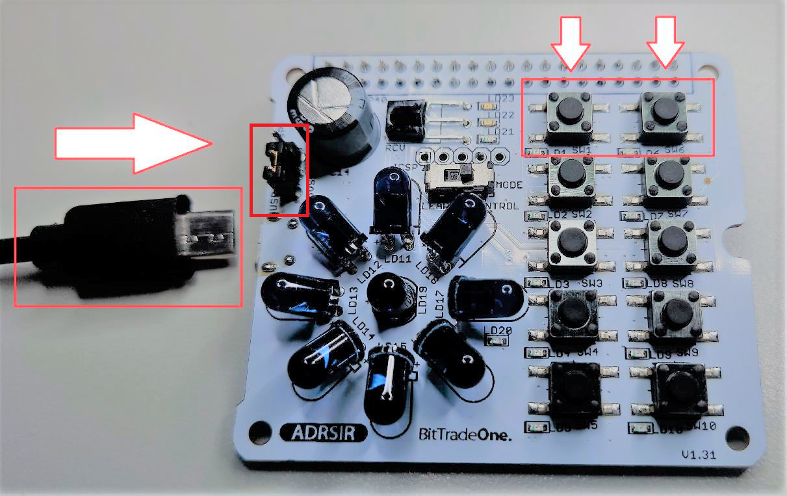

# ファイルリスト

 - ADRSIR_UpdateTool_v110.exe
 ファームウェアアップデートツールです。ダウンロードしてご使用ください。

# ADRSIR ファームウェアアップデート手順
2021/07/19 初版 
2022/05/24 改定 
 

本文書では、ラズベリー・パイ専用 学習リモコン基板のファームウェアアップデート手順について説明します。  

> <strong>※ADRSIR bootloader Firmware Version : 1.0 の場合ファームウェアアップデートツールが使用できません。</strong>  
> 手順4. ファームウェアのアップデートまで進めていただき、そこに表示されるバージョンを確認してください。  
> このとき、<strong>ADRSIR bootloader Firmware Version : 1.0であれば アップデートボタンは押さないで</strong>ください。  
> アップデートツールが使用できない場合は[お問い合わせ](https://bit-trade-one.co.jp/contactus/)ください。

## 1. ADRSIR本体の準備
ADRSIR本体のみを用意します 。

## 2. ファームウェアアップデートツールの起動
 
 [__ファームウェアアップデートツール_ダウンロードリンク__](https://github.com/bit-trade-one/ADRSIR_RaspberryPi_IR_Leaning_Controller/raw/master/FW_Update_tool/ADRSIR_UpdateTool_v110.exe)  
 
PC側で __ファームウェア アップデート ツール__ をダウンロードし、起動します

## 3. PCとの接続
 - 電源切換え用のジャンパ（5VSEL)を「USB」側に切換えます。
 - 表面の SW1とSW6の両方を押下したままUSBケーブルでPCと接続し、bootモードにします。
成功すると基板上のLEDが赤と青に点滅します 。

## 4. ファームウェアのアップデート
接続が確認されると 左下に 「 USB connected」 と 表示され 、 「 Updateボタン 」 が 押下できる状態になります。ボタンを押下すると、ファームウェアの書込みを開始します 。 書込み中はUSBケーブルを抜かないでください。書込みに失敗すると再書込みできなくな
る場合があります。 

  
（注）bootloader Firmware Versionで表示されるバージョンはbootloaderのバージョンでファームウェアバージョンではありません。

## 5. アップデートの確認
ファームウェアの書換えが完了すると、「Verification successfull」と表示されます。

## 6. ファームウェアアップデートの完了
USBケーブルを取り外し、ファームウェアアップデートを完了します。 
必要に応じて電源切換え用のジャンパ（5VSEL)を切換えてください。
